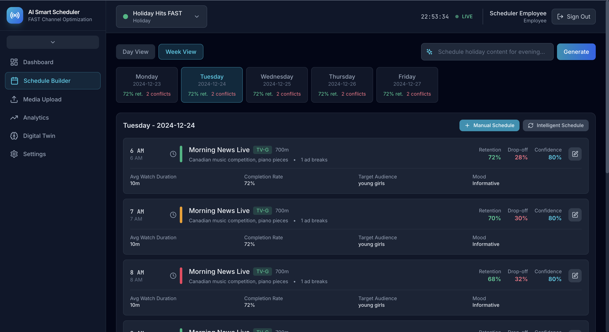
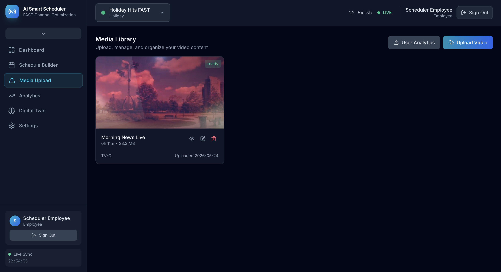
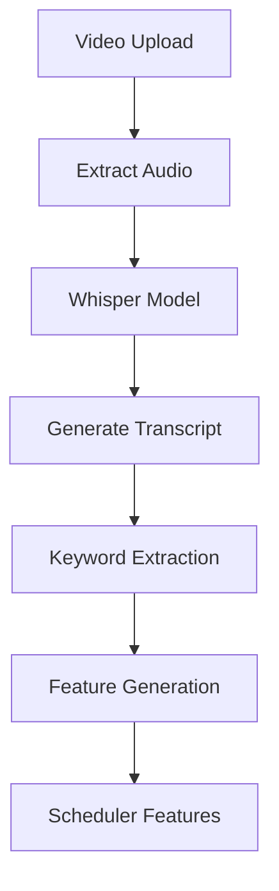
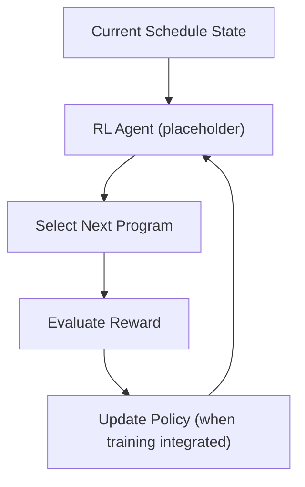
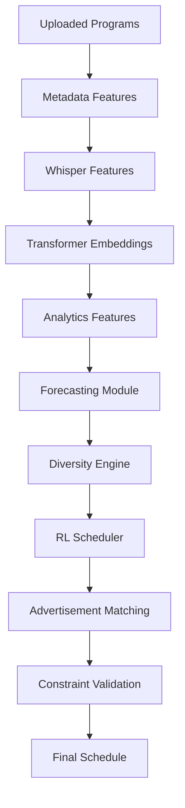
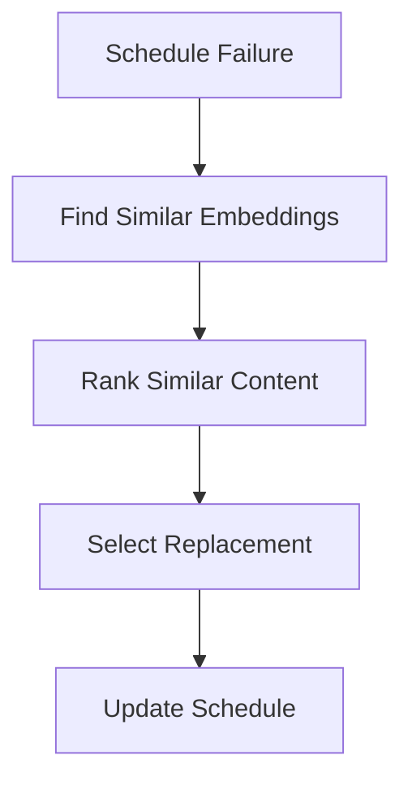

# Smart Scheduler

Smart Scheduler is an AI-driven FastAPI + React media scheduling platform that automatically generates optimized FAST/TV channel schedules using uploaded programs, content understanding models, audience analytics, forecasting models, and reinforcement learning concepts.

Unlike traditional scheduling systems that use static rules or manual planning, Smart Scheduler is designed to learn from audience behavior and adapt schedules to maximize retention, engagement, diversity, and ad effectiveness while preventing repetitive content patterns.

---

# Application





---

# Model Architecture


---

# Tech Stack

## Backend

- FastAPI
- SQLite
- PyTorch
- transformers (optional hooks in `server/llm_metadata.py`)
- `whisperx` (used for transcription in `server/transcription_service.py`)
- XGBoost-style prediction 
- NumPy
- Pandas

## Frontend

- React
- TypeScript
- Vite

---

# AI Methodology

## 1. Content Understanding Pipeline

Raw media files cannot directly be used for scheduling decisions.

Each uploaded program first goes through a content understanding process where structured features are extracted.

### Extracted Features

- Program title
- Genre
- Duration
- Release year
- Target audience
- Actors
- Language
- Tags
- Mood
- Category
- Rights information
- Time restrictions

---

## 2. Speech Understanding using WhisperX

Metadata alone cannot fully describe content.

Speech often contains contextual information that significantly influences audience behavior.

The system uses `whisperx` (a Whisper runtime/wrapper) for transcription; see `server/transcription_service.py`.

### Purpose

- Speech-to-text conversion
- Subtitle generation
- Topic extraction
- Context detection
- Keyword generation
- Sentiment extraction

---

## Whisper Pipeline



---

## 3. Transformer-Based Content Representation

After transcription and metadata extraction, transformer models are used to generate semantic vectors.

### Notes

- The repository contains optional hooks to the `transformers` library (see `server/llm_metadata.py`) for text-generation/metadata extraction.
- The catalog currently contains mocked embedding vectors (`server/catalog.py`) used by components such as the self-heal and similarity logic. Replace these mocked vectors with a Sentence-Transformer or other embedding model when integrating full semantic encoding.

Purpose:

- Understand content relationships
- Find similar programs
- Support self-healing
- Improve recommendations
- Calculate transition quality

---

## 4. Audience Analytics Learning

The scheduler learns from imported program analytics.

### Imported Metrics

- Concurrent viewers
- Unique viewers
- Average watch duration
- Retention curve
- Drop-off timestamps
- Viewer entry points
- Viewer exit points
- Ad impressions
- Ad completion rates
- Device type
- Geographic distribution
- Interaction CTR

---

## 5. Forecasting Module

Historical analytics are used to estimate future performance.

### Inputs

- Watch duration
- Retention
- Previous schedules
- Day / Season / Month
- Time slot

### Outputs

- Predicted viewers
- Predicted watch time
- Predicted retention

Example:

Friday 8 PM:

```
Comedy Program

Predicted Viewers = 80,000

Predicted Retention = 76%
```

---

## 6. Reinforcement Learning Scheduler (Conceptual)

The codebase is structured to support RL-style scheduling optimization, but there is no production RL training loop integrated in the backend (no Stable-Baselines3/PPO training included). The UI labels a "PPO Scheduler" as a conceptual/experimental scheduler.

If you integrate an RL library, PPO is a reasonable candidate; the following state/action/reward structure is a suggested starting point.



Suggested state inputs:

- Current time slot
- Day, month, season
- Recent schedule history
- Forecasted viewers and retention
- Diversity score
- Ad performance
- Historical viewer patterns

Suggested actions:

- Select next program
- Advertisement placement
- Program sequencing decisions

Suggested reward decomposition:

```
Reward = 0.35 × WatchTime
         + 0.25 × Retention
         + 0.20 × AdRevenue
         + 0.10 × Diversity
         + 0.10 × Novelty

Penalty = 0.20 × Repetition + 0.20 × DropOff

FinalReward = Reward − Penalty
```

---

## 7. Scheduling Logic



---

## 8. Diversity and Novelty Engine

A scheduler should avoid repeatedly showing high-performing content.

### Novelty Formula

```
NoveltyScore = 1 / RecentFrequency
```

Penalty Conditions:

- Repeated programs
- Repeated genres
- Repeated actors
- Repeated series
- Similar themes

Purpose:

Maintain balanced and fresh programming.


---

## 9. Self-Healing Scheduling

If content becomes unavailable:

- Missing file
- Expired rights
- Corrupted media
- Upload failure

The system selects replacement content using embedding similarity (catalog embeddings are currently mocked).

Cosine similarity:

```
Cos(θ) = (A·B) / (|A| × |B|)
```

Self-Healing Flow:



---

# Features

- Media Upload
- WhisperX Transcription
- Transformer-Based Feature Extraction (hooks)
- Analytics Import
- Forecasting
- Scheduling (analytics-driven)
- Diversity Control
- Advertisement Matching
- Self-Healing Scheduling
- Manual Override
- Admin Dashboard

---

# Run

## Backend

```bash
python3 main.py
```

## Frontend

```bash
cd Frontend
npm install
npm run dev
```

---

## Open

Backend API:

```
http://localhost:8000
```

Frontend:

```
http://localhost:5173
```

---


## Demo Credentials (Hardcoded for Local Development)

Use these demo credentials for the local/admin UI during development only. Do NOT use in production.

```
Username: employee@example.com
Password: Employee123!
```
---

## Authors

**Badrinathan T V**  

GitHub: https://github.com/BadrinathanTV

---

**Neeraj T**  

GitHub: https://github.com/Neerajdec2005

<!-- --- -->
